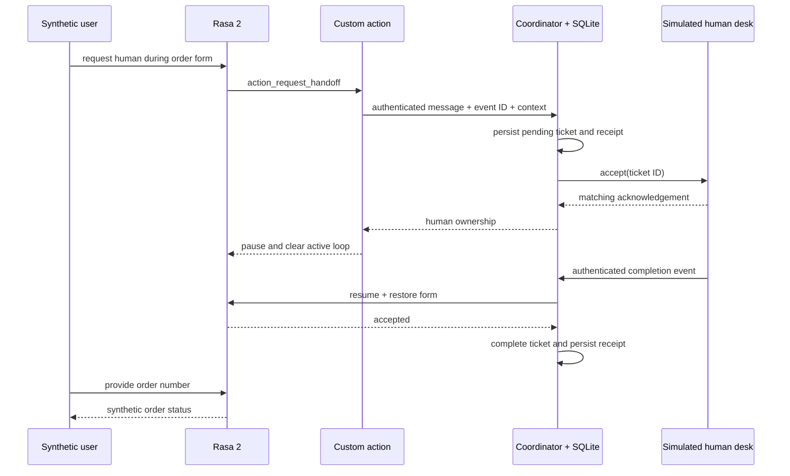

# ADR 001: preserve ownership until the receiving system acknowledges

Stack: Rasa 2, Python and SQLite.

## Problem

A bot that pauses immediately after requesting a human can strand a user if the desk is unavailable. Retrying without a stable ticket ID can also create duplicate cases. Completing an old ticket can accidentally resume a different handoff.

## Decision

Use durable `bot → pending → human → bot` state. Persist a message receipt and the pending ticket in one SQLite transaction, keyed by conversation/event IDs. Preserve a bounded transcript and active form. Send a ticket ID to the simulated desk, and require matching acknowledgement before pausing Rasa. Completion must reference the active acknowledged ticket.

Persist Rasa trackers in a separate SQLite named volume. Disable automatic session expiry and guard the built-in restart action with the ticket slot and coordinator ownership. Pausing records `action_listen` so Rasa's rule policy routes `/restart` to the guard instead of rewinding the pause through a fallback. Completion restores the form and listening state before the next user input. Each new handoff refreshes explicitly supplied transcript context; omitted context preserves the coordinator's existing history.

The desk is simulated in the coordinator process but keeps a separate durable acceptance table. This verifies protocol behavior; it does not establish integration with a real provider.

## Consequences

Transactions prevent duplicate local side effects. A content fingerprint rejects event-ID reuse with a different payload. A bounded callback failure rolls back completion and leaves the human in control. Across the HTTP/Rasa boundary, a lost acknowledgement can require replaying resume events; delivery is at least once. There is no claim of exactly-once distributed execution.

The local prototype serializes writers and holds the completion transaction during a maximum three-second HTTP call. This keeps the demonstration understandable but limits throughput. A production implementation should replace the callback with an outbox/resume worker and explicit per-conversation event sequence numbers.

## Trust boundaries

Only loopback host ports are published. The coordinator uses a generated bearer credential for transcript/ticket access and writes; Rasa administrative endpoints have a separate token. Tokens are in ignored `.env`, never in evidence or logs. No real user or customer data is included. Rasa REST-channel demo messages remain local; the internal action endpoint is not host-published.
